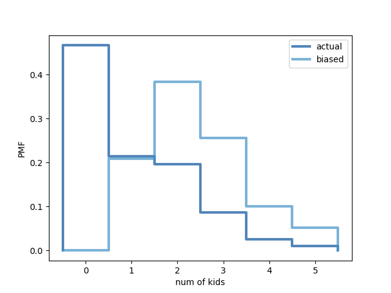

[Think Stats Chapter 3 Exercise 1](http://greenteapress.com/thinkstats2/html/thinkstats2004.html#toc31) (actual vs. biased)

**Exercise 3.1** Something like the class size paradox appears if you survey children and ask how many children are in their family. Families with many children are more likely to appear in your sample, and families with no children have no chance to be in the sample.
Use the NSFG respondent variable `NUMKDHH` to construct the actual distribution for the number of children under 18 in the household.
Now compute the biased distribution we would see if we surveyed the children and asked them how many children under 18 (including themselves) are in their household.
Plot the actual and biased distributions, and compute their means. As a starting place, you can use `chap03ex.ipynb`.

First, I imported the necessary modules.

```
import thinkstats2
import thinkplot
import nsfg
```

Then, I loaded the NSFG respondent data into a dataframe.

```
resp = nsfg.ReadFemResp()
```

I loaded the NUMKDHH variable into a Series.

```
numkdhh = resp['numkdhh']
```

I created the probability mass function for this variable.

```
pmf = thinkstats2.Pmf(numkdhh, label='actual')
```

Next, I created the PMF for the biased version, using the BiasPmf function provided in ThinkStats.

```
def BiasPmf(pmf, label):
    new_pmf = pmf.Copy(label=label)

    for x, p in pmf.Items():
        new_pmf.Mult(x, x)

    new_pmf.Normalize()
    return new_pmf
    
biased_pmf = BiasPmf(pmf, label='biased')
```

I then calculated the means of both PMFs.

```
print('Mean of actual:', pmf.Mean())
print('Mean of biased:', biased_pmf.Mean())
```

The result:

```
Mean of actual: 1.0
Mean of biased: 2.4
```

Lastly, I plotted the two PMFs.

```
thinkplot.PrePlot(2)
thinkplot.Pmfs([pmf, biased_pmf])
thinkplot.Show(xlabel='num of kids', ylabel='PMF')
```

The result:



So it appears there is a "household size paradox."
