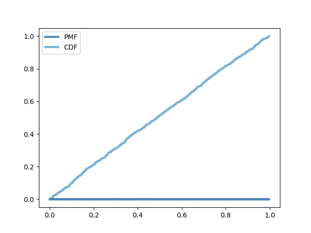

[Think Stats Chapter 4 Exercise 2](http://greenteapress.com/thinkstats2/html/thinkstats2005.html#toc41) (a random distribution)

**Exercise 4.2** The numbers generated by `random.random` are supposed to be uniform between 0 and 1; that is, every value in the range should have the same probability.
Generate 1000 numbers from `random.random` and plot their PMF and CDF. Is the distribution uniform?

First, I imported the necessary modules.

```
import thinkstats2
import thinkplot
import random
```

Next, I generated a list of 1000 random numbers.

```
randlist = list()
for i in range(1000):
    randlist += [random.random()]
```

I then generated the PMF and CDF of this list of numbers.

```
pmf = thinkstats2.Pmf(randlist, label="PMF")
cdf = thinkstats2.Cdf(randlist, label="CDF")
```

Finally, I plotted them together.

```
thinkplot.PrePlot(2)
thinkplot.Pmf(pmf)
thinkplot.Cdf(cdf)
thinkplot.Show()
```

The result:



The PMF is even height all the way across, and the CDF is a straight line approximating `y = x`. Based on this, the random numbers do appear to be uniformly distributed.
